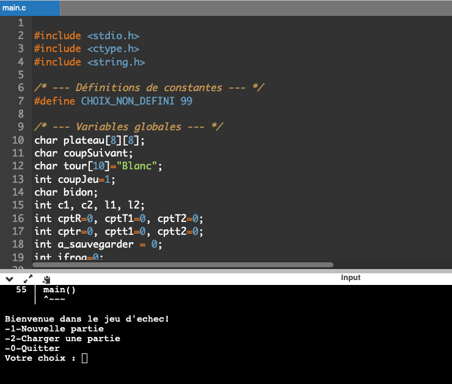
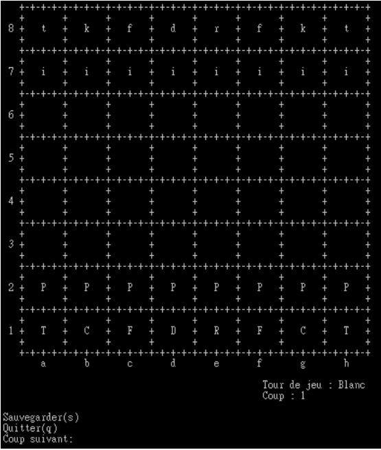

# Chess game

The project must allow a single user to be able to play a game of chess against himself from a program written in C language. This program will include all the elements essential to the progress of the game: the game board, the 32 pieces, the different moves and the victory conditions. The program will allow the user to save a game and resume it later.

This is a school project, and I completed it with 1 classmate. Each of us was responsible for different parts, and I was mainly responsible for the coding.

## Documentation

[Documentation](CahierdeCharges.pdf)
[GameGuide](Guide_JeuEchce.pdf)


## Built with

Built with Macbook. Xcode which is Apple's compiler and development tools must be installed.

Install in Terminal
```
xcode-select --install
```

## Usage

Compile the code by simply running gcc 

Command1: compile
```
gcc -Wall -o chessgame jeuEchec.c
```
If on newer versions of OS X:
```
clang jeuEchec.c -o chessgame
```

Command2: run
```
./chessgame
```
Then the game will be started.

The files whose names begin with "Test" are the files that you can load into the game with "2 - Loading".

They will help you do game function testing.

## Screenshots





## License

[MIT](https://choosealicense.com/licenses/mit/)

